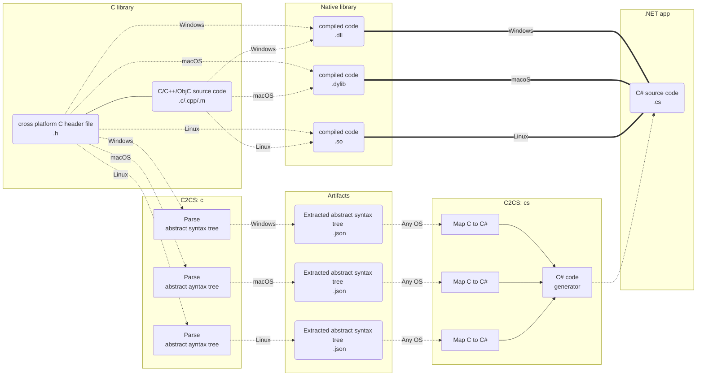

# C2CS

C to C# library bindings code generator. In go `.h` file, out come `.cs` file. First class support for Apple platforms
and hardware.

## Documentation

For documentation on supported platforms, limitations, how to install `C2CS`, how to use `C2CS`, how to build `C2CS`,
etc, see the [docs/README.md](docs/README.md).

## C# bindings of C libraries using C2CS

| C library  | C# bindings |
|:----------:|:-----------:|
|[flecs](https://github.com/SanderMertens/flecs)|https://github.com/flecs-hub/flecs-cs|
|[sokol](https://github.com/floooh/sokol)|https://github.com/bottlenoselabs/sokol-cs|
|[SDL](https://github.com/libsdl-org/SDL)|https://github.com/bottlenoselabs/SDL-cs|
|[FAudio](https://github.com/FNA-XNA/FAudio)|https://github.com/bottlenoselabs/FAudio-cs|

## Background: Why?

### Problem

When creating applications with C# (especially games), it's sometimes necessary to dip down into the C language for
better raw performance and overall better portability of different low-level APIs accross platforms. This is what FNA
does today and
what [MonoGame will be doing in the future](https://github.com/MonoGame/MonoGame/issues/7523#issuecomment-865808668).
However, the problem is that maintaining the C# bindings by hand becomes time consuming, error-prone, and in some cases
quite tricky.

Note that generating bindings from C++, ObjectiveC, or other languages are not considered as part of the problem scope
because they do not align to specific goals. Though, perhaps [Zig](https://ziglang.org) or some other language may
emerge in the future as superior to C for such goals.

- Portability. For better or worse, C *can be used* as the industry's standard portable assembler even if technically
  speaking it is not. Writing a native library in the C language (with some constraints) and building it for multiple
  targets such as Windows, macOS, Linux, iOS, Android, etc, is the path of least resistance, especially for more
  non-traditional targets such as RaspberryPi, WebAssembly or consoles.
- Interopability. The C language, specfically the usage of data structures and functions in limited scope, is a common
  demonitor between C and many other languages including C#. This makes interaction between C and C# (and other
  languages) not only correct but as fast and efficient as possible.
- Maintainability. Writing and maintaining a C code project is arguably simpler, especially if targeting multiple
  platforms, due to C being a relatively small language in comparison to C++/ObjectiveC. This makes the C language
  arguably easier to learn and work with, especially if limited in scope such as avoiding the use of macros. This is
  important for open-source projects (in contrast to proprietary-enterprise-like projects) where one of the barriers to
  development is knowledge sharing at scale in a decentralized fashion.

### Solution

Automate the generation of the C# bindings by compiling/parsing a C `.h` file. The C API (application programmer
interface; those functions you want to call) is transpiled to C# for the target platform (a Clang target
triple `arch-vendor-os-environment`) for use via P/Invoke (platform invoke).

All C extern functions which are transpiled to `static` methods in C# using `DllImport` attribute. Includes the C types
which are found through transitive property to the extern functions such as: `struct`s, `enum`s, and `const`s.
C# `struct`s are generated instead of `class`es on purpose to achieve 1-1 bit-representation of C to C# types called *
blittable* types. For more details why blittable types matter
see [docs/LESSONS-LEARNED.md#marshalling](./docs/LESSONS-LEARNED.md#marshalling).

This is accomplished by using [libclang](https://clang.llvm.org/docs/Tooling.html) for parsing C
and [Roslyn](https://github.com/dotnet/roslyn) for generating C#. All naming is left as found in the C header `.h` file(
s).

For more details on why `C2CS` is structured into `c` and `cs` see [docs/SUPPORTED-PLATFORMS.md#restrictive-or-closed-source-system-headers](./docs/SUPPORTED-PLATFORMS.md#restrictive-or-closed-source-system-headers).

### Limitations

1. .NET 5+ is recommended because C# 9 function pointers are recommended. The usage of C# 9 function pointers can be
   turned off and a fallback to using delegates for function pointers can be used. This allows bindings to be created
   for versions of .NET before .NET 5. However, this can have consequences on performance due to use of the Garbage
   Collector getting involved for using delegates in C# to do callbacks from C. Your milage may vary.

2. Strings. In C# `char` is 2 bytes. In C `char` is 1 byte. This makes things tricky. There is a `CString` for ANSI C strings (`char*`) and `CStringWide` for UNICODE C strings (`wchar_t*`). Please pay attention to the following notes about converting back and forth between C# strings and C strings.

`explicit CString(string value)`: C# string to C char* allocates **UNMANAGED MEMORY** and copies the C# string into said memory using `Marshal.StringToHGlobalAnsi`.
`explicit CStringWide(string value)`: C# string to C wchar_t* allocates **UNMANAGED MEMORY** and copies the C# string into said memory using `Marshal.StringToHGlobalUni`.
`explicit string(CString value)`: C char* to C# string allocates **MANAGED MEMORY** and copies the C string into said memory using `Marshal.PtrToStringAnsi`.
`explicit string(CStringWide value)`: C wchar_t* to C# string allocates **MANAGED MEMORY** and copies the C string into said memory using `Marshal.PtrToStringUni`.

For **UNMANAGED MEMORY**, it is upon the developer to handle freeing the unmanaged C string at an appropriate time using `Marshal.FreeHGlobal`. Failure to comply may result in a memory leak.

For **MANAGED MEMORY**, the garbage collector will generally clean up after you. What this means is that when there are no more roots to the C# string, the garbage collector when under memory pressure may decide to free said memory. However, this may result in halting your C# application temporarily (either on the main thread or on a separate thread) causing stutter or lag. If this is unacceptable please consider caching your strings.

3. `C2CS` does not work for every C library. This is due to some technical limitations where some C libraries are not "
   bindgen-friendly".

#### What does it mean for a C library to be bindgen-friendly?

Everything in the [**external
linkage**](https://stackoverflow.com/questions/1358400/what-is-external-linkage-and-internal-linkage) of the C API is
subject to the following list. Think of it as the check list to creating a bindgen friendly, cross-platform, C library
for P/Invoke in C#.

Note that the internals of the C library is irrelevant and to which this list does not apply. In this sense it is then
possible to use C++/ObjectiveC behind a implementation file (`.cpp` or `.m` respectively) or reference C++/ObjectiveC
from a C implementation file (`.c`). All that `C2CS` needs is the C interface file (`.h`) for interoperability with C#.

|Supported|Description|
|:-:|-|
|:white_check_mark:|Function externs 3|
|:x:|Variable externs 1|
|:white_check_mark:|Function prototypes (a.k.a., function pointers.) 3|
|:white_check_mark:|Enums 2|
|:white_check_mark:|Structs 3 & 4 & 5|
|:white_check_mark:|Unions 3 & 4 & 5 & 6|
|:white_check_mark:|Opaque types. 3 & 4 & 7|
|:white_check_mark:|Typedefs (a.k.a, type aliases) 3|
|:o:|Function-like macros 8|
|:white_check_mark:|Object-like macros 9|
|:o:|Implicit types 10|
|:x:|`va_list`11|
|:white_check_mark:|`wchar_t`12|

1: Do not use variable externs. This is because there is no alternative for `DllImport` attribute in C# for
extern variables. The recommended simplest solution to expose variable externs to C# from C is to instead create "
getter" and/or "setter" functions which just return the value of the variable. It is technically possible to not
use `DllImport` and instead use `dlsym` on Unix and `GetProcAddress` on Windows allow getting the address of a variable
exported for shared libraries (`.dll`/`.dylib`/`.so`). However, this is only possible for dynamic loading and not
possible for statically linked libraries.
See [docs/SUPPORTED-PLATFORMS.md: Calling C platform code from your .NET application](docs/SUPPORTED-PLATFORMS.md) for
more details about dynamic loading and static linking. Thus, variable externs are not supported.

2: Do not assume the value of an enum is always an unsigned or signed integer in C. However, enums are forced
to be signed type in C#. This is allow for better convergence across platforms such as Windows, macOS, and Linux because
enums in C can be signed or unsigned depending on the compiler.

3: Do use standard integer types from `stdint.h` such as `int32_t`, `uint64_t`, etc which are portable. Do
not use C's primitive integer types directly such as `unsigned long` as they are not garanteed to portable due to
possibly having different bitwidths for different compilers or platforms.

4: Do consider the fields of a struct or union as public in C. This is because distinguishing between
public/private struct (and union) fields is not possible automatically. If the record is transtive to a function extern
then it will be transpiled as if all the fields were public. In some cases this may not be appropriate to which there is
the following options. Either, use proper information hiding with C headers so the private fields are not in transtive
property to a public function extern, or use pointers to access the struct and manually specify the struct as an opaque
type for input to `C2CS`. Option 2 is the approach taken for generating bindings for https://github.com/libuv/libuv
because `libuv` makes use of mixing public/private struct fields and struct inheritance.

5: Do not use bitfields. This is because bitfields may have different bit layouts across different
compilers (e.g. GCC vs MSCV). Generating C# bindings that are cross-platform works when there is consisent bit layout
for data types across compilers. In other words, bitfields *may* break portability and thus platform specific bindings
may be required.

6: C# allows for unions using explicit layout of struct fields. Anonymous unions are transpiled to a struct.

7: For opaque types, if the C header file has direct knowledge of the actual implementation, then they will
be by default transpiled as if they were not opaque types. To overcome this, the opaque types in question will need to
be manually specified for input to `C2CS`. This a common scenario for single file header libraries such
as https://github.com/nothings/stb.

8: Function-like macros are only possible if the parameters' types can be inferred 100% of the time during
preprocessor; otherwise, not possible. **Not yet implemented**.

9: Object-like macros have full support. They are transpiled to fields in C# which the value type is
determined by evaluating the value of the macro as an C expression using `auto` in C++ to determine the type.

10: Types must be explicitly transtive to a function extern so they can be found. "Dangling" enums are by
default not included as part of the bindgen. `C2CS` offers an option to include these "dangling" enums. This is common
for some C libraries such as https://github.com/libsdl-org/SDL where functions take integers as part of their API but
are actually expecting an enum.

11: For support with `va_list` see https://github.com/lithiumtoast/c2cs/issues/15.

12: `wchar_t*` is mapped to `CStringWide` which is an opaque pointer, that is fine. What is not fine is
that `wchar_t` itself by default is is 2 bytes on Windows and 4 bytes on Linux (it also be 1 byte on some embedded
systems or otherwise different on various hardware). It can be forced to be the same across hardware using
the `-fshort-wchar` compiler flag for Clang, but this has consequences. Some hardware vendors enforce that all linked
objects must use the same `wchar_t` size, including libraries. It is then not possible or at very least unstable to link
an object file compiled with `-fshort-wchar`, with another object file that is compiled without `-fshort-wchar` such as
standard libraries. The approach taken for `C2CS` is to use either 1, 2 or 4 for the C# mapped type `CCharWide` that is
blittable to `wchar_t`. The exact size of bytes depend on the target operating system by default but can be overriden by
specifying the property `SIZEOF_WCHAR_T` to a value of `1`, `2`, or `4` in your C# project. For more information on how
this works, please
see [How to use `C2CS.Runtime` - Custom C# project properties for `C2CS.Runtime`](docs/README.md#custom-c-project-properties-for-c2csruntime)
. Note however that if any of your public header structs use `wchar_t` then the resulting struct may be different sizes
across platforms. In such a case it is no different than pointers limitation mentioned earlier in terms of a solution.

#### What do I do if I want to generate bindings for a non bindgen-friendly C library?

Options:

1. Change the library so that the **external linkage** becomes bindgen-friendly according the above list.
2. Consider a similar project which solves your problem. (See next section.)

### Other similar projects

Mentioned here for completeness. I do believe you should be aware of other approaches to this problem and see if they make more sense to you. Keep in the mind that the goals of `C2CS` is for strictly creating cross-platform C# bindings for C in the context of real-time applications and games. Most of the solutions below are not aligned to the goals of `C2CS` because they are either focusing on specific platforms, are for C++ / ObjectiveC, or are not considering the context of real-time applications / games.

- https://github.com/dotnet/runtimelab/tree/feature/DllImportGenerator & https://github.com/microsoft/ClangSharp: The "Microsoft way"tm of generating C# bindings for C/C++ with a first class support for C++, Windows, and MSCV. In my experience, non Windows platforms such as Linux and macOS and non-MSCV compilers are not really considered "first class" by Microsoft even if they are or are eventually supported. I would recommend you use this solution over `C2CS` if you are looking to generate C# bindings for C/C++ in the context of a business/enterprise application, especially for Windows.
- https://github.com/microsoft/CsWin32: The "Microsoft way"tm of generating C# bindings for native Win32 using a source generator; pretty cool stuff.
- [Xamarin's Objective Sharpie](https://docs.microsoft.com/en-us/xamarin/cross-platform/macios/binding/objective-sharpie/): The Mono team's (now Xamarin's) tool for generating C# bindings for C/ObjectiveC with first class support for ObjectiveC, macOS, and Clang. I would recommend you use this solution over `C2CS` if you are looking to generate C# bindings for C/ObjectiveC in the context of business/enterprise applications, especially for Apple platforms such as macOS and iOS. 
- https://github.com/SharpGenTools/SharpGenTools: Tool for generating C# bindings for C++ with a focus on performance.
- https://github.com/xoofx/CppAst.NET: Tool for parsing C/C++ header files. You could write your own C# bindings
  generator using this.

## License

`C2CS` is licensed under the MIT License (`MIT`).

There are a few exceptions to this detailed below. See the [LICENSE](LICENSE) file for more details on this main
product's license.

`C2CS` uses `libclang` which the header files are included as part of the repository under [`ext/clang`](./ext/clang).
This is because `C2CS` generates bindings for `libclang` to which `C2CS` generates bindings for `libclang` and other C
libraries. The C header `.h` files (no source code `.c`/`.cpp` files) for `libclang` are included for convience of a
source-of-truth for re-generating the bindings. These files are licensed under the Apache License v2.0 with LLVM
Exceptions; see the [ext/clang/LICENSE.txt](./ext/clang/LICENSE.txt) for more details.

