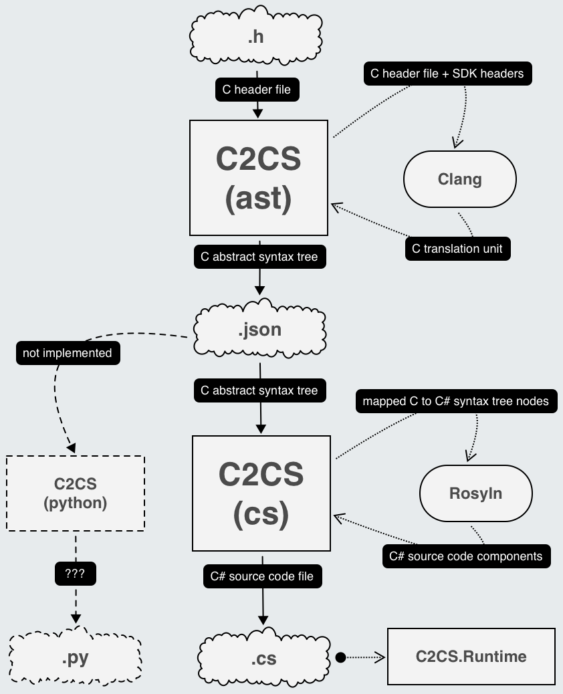

# C2CS

C to C# library bindings code generator. In go `.h` file, out come `.cs` file.

## Documentation

For documentation on supported platforms, limitations, how to install `C2CS`, how to use `C2CS`, how to build `C2CS`, etc, see the [docs/README.md](docs/README.md).

## C# bindings of C libraries using C2CS

|C library|C# bindings|
|:-:|:-:|
|[flecs](https://github.com/SanderMertens/flecs)|https://github.com/flecs-hub/flecs-cs|
|[sokol](https://github.com/floooh/sokol)|https://github.com/bottlenoselabs/sokol-cs|

## Background: Why?

### Problem

When creating applications with C# (especially games), it's sometimes necessary to dip down into C/C++ for better raw performance and overall better portability of various different low-level APIs accross various platforms. (This is what FNA does today and what [MonoGame will be doing in the future](https://github.com/MonoGame/MonoGame/issues/7523#issuecomment-865808668).) However, the problem is that maintaining the C# bindings becomes time consuming, error-prone, and in some cases quite tricky.

### Solution

Automate the generation the C# bindings by compiling/parsing a C `.h` file. The C API (application programmer interface; those functions you want to call) is tranpiled to C# for the target platform (a Clang target triple `arch-vendor-os-environment`) for use via P/Invoke (platform invoke).

All C extern functions which are transpiled to `static` methods in C# using `DllImport` attribute. Includes the C types which are found through transitive property to the extern functions such as: `struct`s, `enum`s, and `const`s. C# `struct`s are generated instead of `class`es on purpose to achieve 1-1 bit-representation of C to C# types called *blittable* types. For more details why blittable types matter see [docs/LESSONS-LEARNED.md#marshalling](./docs/LESSONS-LEARNED.md#marshalling).

This is all accomplished by using [libclang](https://clang.llvm.org/docs/Tooling.html) for parsing C and [Roslyn](https://github.com/dotnet/roslyn) for generating C#. All naming is left as found in the C header `.h` file(s).

  

For more details on why `C2CS` is structured into `ast` and `cs` see [docs/SUPPORTED-PLATFORMS.md#restrictive-or-closed-source-system-headers](./docs/SUPPORTED-PLATFORMS.md#restrictive-or-closed-source-system-headers).

## License

`C2CS` is licensed under the MIT License (`MIT`).

There are a few exceptions to this detailed below. See the [LICENSE](LICENSE) file for more details on this main product's license.

`C2CS` uses `libclang` which the header files are included as part of the repository under [`ext/clang`](./ext/clang). This is because `C2CS` generates bindings for `libclang` to which `C2CS` generates bindings for `libclang` and other C libraries. The C header `.h` files (no source code `.c`/`.cpp` files) for `libclang` are included for convience of a source-of-truth for re-generating the bindings. These files are licensed under the Apache License v2.0 with LLVM Exceptions; see the [ext/clang/LICENSE.txt](./ext/clang/LICENSE.txt) for more details.

