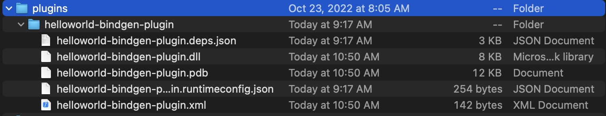

# Documentation

- [Documentation](#documentation)
  - [Supported platforms](#supported-platforms)
  - [Lessons Learned](#lessons-learned)
  - [Installing `C2CS`](#installing-c2cs)
    - [Latest release](#latest-release)
    - [Latest pre-release](#latest-pre-release)
  - [How to use `C2CS`](#how-to-use-c2cs)
    - [Configuration `.json` properties](#configuration-json-properties)
  - [Cross-parsing with `C2CS`](#cross-parsing-with-c2cs)
  - [How to use `C2CS.Runtime`](#how-to-use-c2csruntime)
    - [Custom C# project properties for `C2CS.Runtime`](#custom-c-project-properties-for-c2csruntime)
      - [`SIZEOF_WCHAR_T`:](#sizeof_wchar_t)
  - [Building `C2CS` from source](#building-c2cs-from-source)
    - [Prerequisites](#prerequisites)
    - [Visual Studio / Rider / MonoDevelop](#visual-studio--rider--monodevelop)
    - [Command Line Interface (CLI)](#command-line-interface-cli)
  - [Debugging `C2CS` from source](#debugging-c2cs-from-source)
    - [Debugging using logging](#debugging-using-logging)
  - [Examples](#examples)
    - [Hello world](#hello-world)
    - [libclang](#libclang)

## Supported platforms

See [SUPPORTED-PLATFORMS.md](./SUPPORTED-PLATFORMS.md).

## Lessons Learned

See [LESSONS-LEARNED.md](./LESSONS-LEARNED.md).

## Installing `C2CS`

`C2CS` is distributed as a NuGet tool. To get started all you need is the .NET software development kit to access `dotnet tool`.

### Latest release

```bash
dotnet tool install bottlenoselabs.c2cs.tool --global 
```

### Latest pre-release

```bash
dotnet tool install bottlenoselabs.c2cs.tool --global --add-source https://www.myget.org/F/bottlenoselabs/api/v3/index.json --version "*-*"
```

- 💡 For a specific pre-release, including a specific pull-request or the latest Git commit of the `main` branch, see: https://www.myget.org/feed/bottlenoselabs/package/nuget/bottlenoselabs.C2CS.
- 💡 If you see a specific version but the `dotnet tool` command doesn't see it, try clearing your NuGet caches:
```bash
dotnet nuget locals all --clear
```

## How to use `C2CS`

To generate bindings for a C library you need to setup a C# project library plugin which specifies input and controls bindgen. See the [helloworld-bindgen-plugin.csproj](../src/cs/examples/helloworld/helloworld-bindgen-plugin/helloworld-bindgen-plugin.csproj) for an example.

### Build your plugin

Build a C# library plugin and drop its binary output folder into a `plugins` directory of where you wish to execute `c2cs` from. In other words, if the current directory where you execute `c2cs` from is `.`, you need to have a directory `./plugins`. See the below image as an example.



Note that `.deps.json` file is required as it is used to know of dependencies to resolve and load when the plugin is loaded itself. Additionally the property `EnableDynamicLoading` must be `true`, see https://docs.microsoft.com/en-us/dotnet/core/project-sdk/msbuild-props#enabledynamicloading for more details.

When `c2cs` startups it will load your C# library plugin (and any dependencies) and use its code to control and configure bindgen. There are two magic interfaces which are important here: `IReaderCCode` and `IWriterCSharpCode`.

- `IReaderCCode`: In the C# project library plugin implement the `IReaderCCode` interface. This is the plugin for reading C code. The `IReaderCCode` is documented via XML comments. For an example of how to implement and use `IReaderCCode` see [helloworld-bindgen-plugin/ReaderCCode](../src/cs/examples/helloworld/helloworld-bindgen-plugin/ReaderCCode.cs).

- `IWriterCSharpCode`: In the C# project library plugin implement the `IWriterCSharpCode` interface. This is the plugin for writing C# code. The `IWriterCSharpCode` is documented via XML comments. For an example of how to implement and use `IWriterCSharpCode` see [helloworld-bindgen-plugin/WriterCSharpCode.cs](../src/cs/examples/helloworld/helloworld-bindgen-plugin/WriterCSharpCode.cs).

### Execute `c2cs`

Run `c2cs` from terminal. If you wish to generate just the abstract syntax tree `.json` files use `c2cs c`. To generate the C# code from the `.json` files use `c2cs cs`.

## How to use `C2CS.Runtime`

The `C2CS.Runtime` C# code is directly added to the bottom of the generated bindings in a class named `Runtime` with a C# region named `C2CS.Runtime`. The `Runtime` static class contains helper structs, methods, and other kind of "glue" that make interoperability with C in C# easier and more idiomatic.

### Custom C# project properties for `C2CS.Runtime`

#### `SIZEOF_WCHAR_T`:

The following only applies and is of interest to you if you are using `wchar_t` directly in the public C header. Note that `wchar_t*` does not apply, it has to be directly using `wchar_t`. 

Use a value of `1`, `2`, or `4` to specify the backing byte field size of `CCharWide`. `CCharWide` in C# is intended to be blittable to `wchar_t` in C. There is no default value set for `SIZEOF_WCHAR_T` but the default size of `CCharWide` is 2. This is incorrect on some platforms like Linux.

To set it:

```xml
<PropertyGroup>
  <SIZEOF_WCHAR_T>2</SIZEOF_WCHAR_T>
</PropertyGroup>
```  

## Building `C2CS` from source

### Prerequisites

1. Install [.NET 6](https://dotnet.microsoft.com/download).
2. Install build tools for C/C++.
    - Windows:
      1. Install Git Bash. (Usually installed with Git for Windows: https://git-scm.com/downloads.)
      2. Install MSCV (Microsoft Visual C++) Build Tools + some C/C++ SDK for Windows. (You can use Visual Studio Installer application to install the C/C++ workload or the components individually. You can also install it all via web or appropriate command line.)
    - macOS:
      1. Install XCode CommandLineTools (gcc, clang, etc): ```xcode-select --install```
      2. Install XCode through the App Store (necessary for SDKs).
      3. Install Brew if you have not already: https://brew.sh
      4. Install CMake: ```brew install cmake```
    - Linux:
      1. Install the software build tools for your distro including GCC, Clang, and CMake.
3. Clone the repository with submodules: `git clone --recurse-submodules https://github.com/lithiumtoast/c2cs.git`.

### Visual Studio / Rider / MonoDevelop

Open `./C2CS.sln`

### Command Line Interface (CLI)

`dotnet build`

## Debugging `C2CS` from source

### Debugging using logging

By default `C2CS` has logs enabled for `Information` level. To enable logs for `Debug` level place the following `appsettings.json` file beside `C2CS` or in the current directory where `C2CS` is being run from. You can also change some other settings for logs through this file.

```json
{
    "Logging": {
        "Console": {
            "LogLevel": {
                "Default": "Warning",
                "C2CS": "Debug"
            },
            "FormatterOptions": {
                "ColorBehavior": "Enabled",
                "SingleLine": true,
                "IncludeScopes": true,
                "TimestampFormat": "yyyy-dd-MM HH:mm:ss ",
                "UseUtcTimestamp": true
            }
        }
    }
}
```

## Examples

Here you will find examples of C libraries being demonstrated with `C2CS` as smoke tests or otherwise used directly.

### Hello world

Hello world example of callings C functions from C#. This is meant to be minimalistic to demonstrate the minimum required things to get this working.

1. Run the C# project [`helloworld-c`](/src/cs/examples/helloworld/helloworld-c/Program.cs). This builds the example shared library and generate the bindings for the [`my_c_library`](/src/cs/examples/helloworld/helloworld-c/my_c_library) C project. The C# bindings will be written to [`my_c_library.cs`](/src/cs/examples/helloworld/helloworld-cs/my_c_library.cs).
2. Run the C# project [`helloworld-cs`](/src/cs/examples/helloworld/helloworld-cs/Program.cs). You should see output to the console of C functions being called from C#.

### [libclang](./001_LIBCLANG.md)

`C2CS` uses bindings generated for libclang using `C2CS`. In this sense, the `C2CS` project eats it's own dogfood.

Run the C# project [`clang-c`](/src/dotnet/prod/libclang-c/Program.cs) to build the shared library and generate the bindings. This project is not like other examples because the generated bindings are used as part of C2CS in the next build. This means that C2CS generates bindings for libclang which then can generate bindings for libclang.

If you just want to see the bindings, you can take a look at [`libclang.cs`](/src/dotnet/prod/libclang-cs/libclang.cs).
